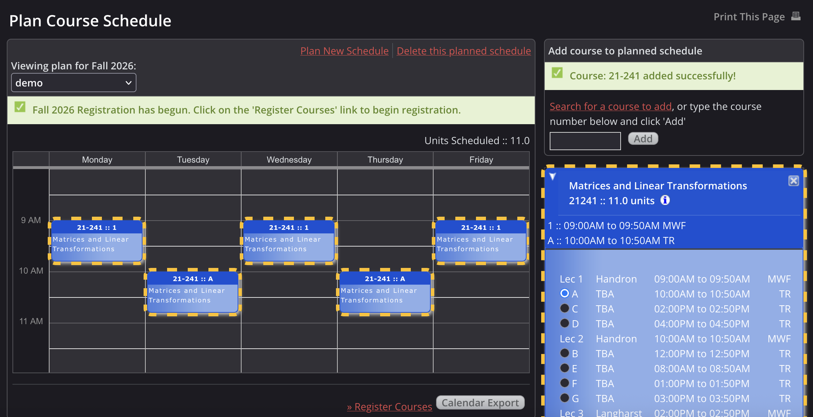
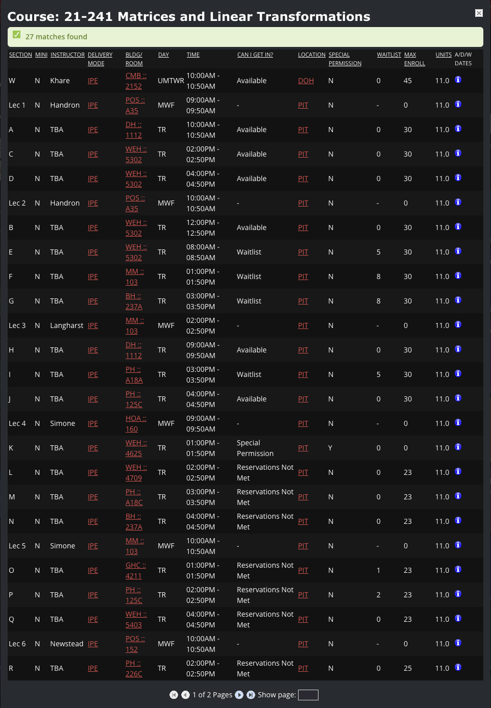
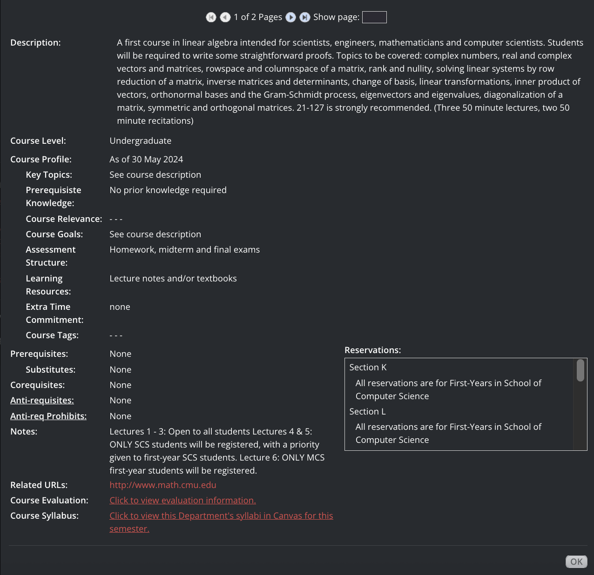
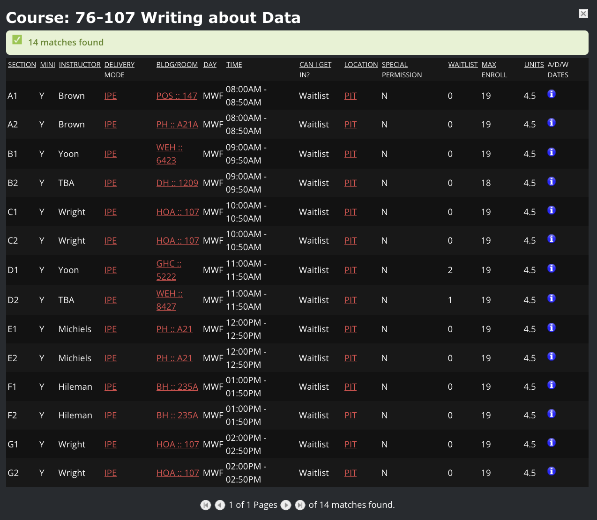
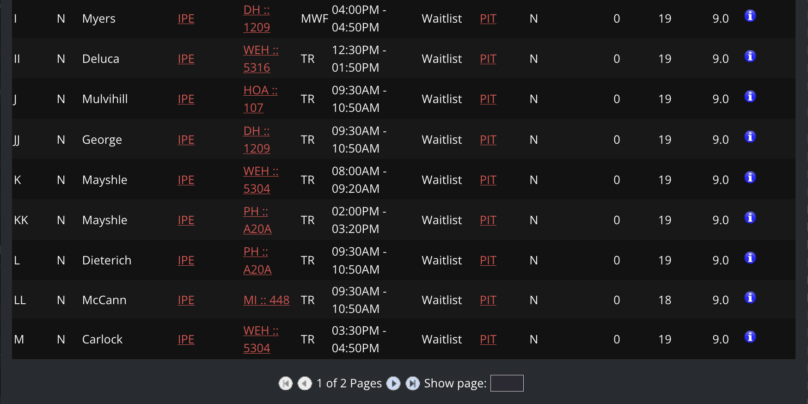
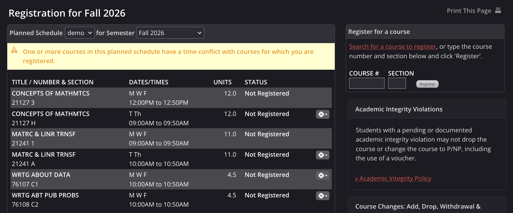
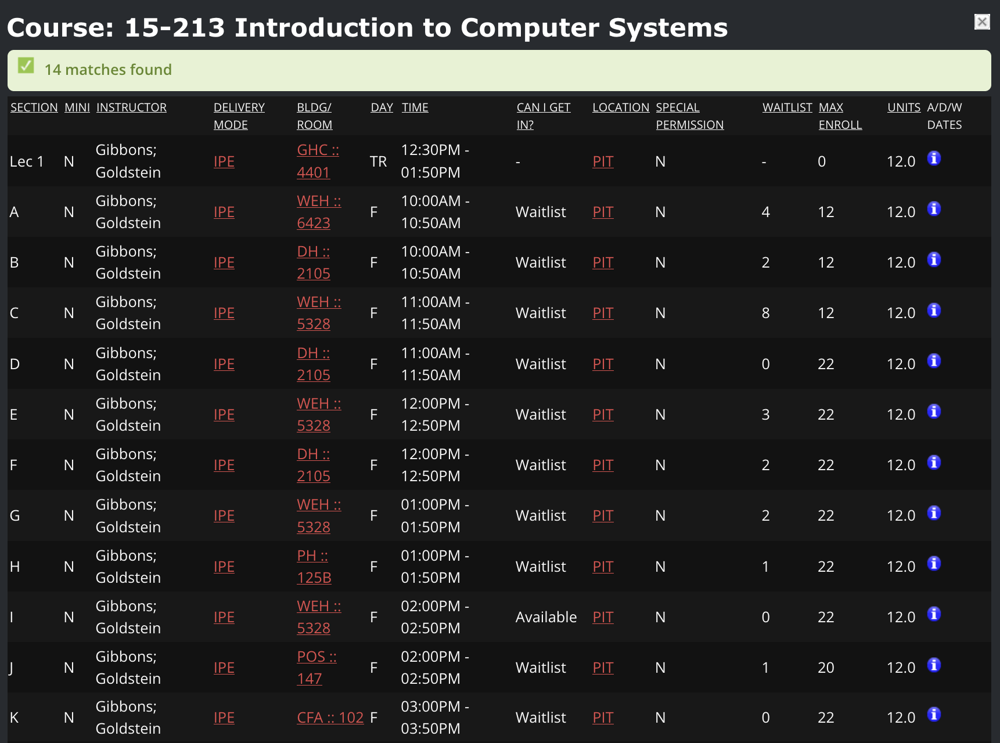

Every CMU student remembers the stress of their first course registration. It's fast-paced, and you rarely get a perfect schedule on your first try. To help you prepare, this article explains how the registration process works, how to build your first-semester plan, and how to navigate waitlists strategically.

## Using this guide
In this article, we use examples that refer to course info pages. You can access any course's info page in **Student Information Online (SIO)** by adding a course to [your planned schedule](https://s3.andrew.cmu.edu/sio/#schedule-plan) and clicking on the Info ℹ️ icon of the course in the right sidebar. Try adding 21-241 to your planned schedule and opening its info page:

<b>Example (21-241)</b>

[Open the Plan Course Schedule page in SIO](https://s3.andrew.cmu.edu/sio/#schedule-plan). Type "21-241" in the top right box labeled "Add course to planned schedule", then hit Enter:

Click on the Info ℹ️ icon of 21-241's box in the right sidebar. You should see something similar to this:

If you scroll down, you will see the course description, prerequisites, and reservations, among other things. We'll explain what these mean later in this article.

## Course basics
### Lectures and Sections
Many large courses have a **lecture** taught by instructors and an associated **section** (also known as recitation, precept, or lab), which are smaller meeting times usually led by Teaching Assistants (TAs). Lectures are denoted by numbers, and sections are denoted by letters. In SIO, the section you select determines which lecture and additional meeting times you attend.

<b>Example (21-241)</b>

According to this image, if you register for 21-241 Section B, that means you will go to
- Lecture 2 on Mondays, Wednesdays, and Fridays from 9:00 to 9:50 AM, <u>and</u>
- Section B on Tuesdays and Thursdays from 12:00 to 12:50 PM.

Smaller courses usually have sections only - in which case, the process is the same: register for the course's section.

#### Sections to avoid
Unless you can afford a plane ride 3-5 times a week, do not register for sections W, X, Y, or Z! These are taught in Qatar, not Pittsburgh.

### Minis
Most courses run for the entire semester, but some courses, known as **minis**, run for half a semester. The number at the end of a section indicates which half it is in: in the Fall, there is Mini 1 and 2, and in the Spring, there is Mini 3 and 4.

<b>Example (76-107)</b>

76-107: Writing About Data is a mini course. Sections A1, B1, C1, D1, E1, F1, and G1 take place in the first half of the semester, while the other sections take place in the second half of the semester.

#### First-Year Writing Minis
If you choose [Pathway 1 of the First-Year Writing requirement](https://www.cmu.edu/dietrich/english/academic-programs/writing-and-communication/fyw-course-options-and-topics.html#:~:text=Pathway%201%20%2D%20Two%20Mini%20Courses,-Choose), make sure that the section number of one of your minis ends in a 1 and that the other ends in a 2 when you register for the mini courses. This will ensure that you schedule one mini for the first half of the semester and the other for the second half.

For example, you might choose 76-106 B1 and 76-107 A2. You would <u>not</u> choose 76-106 B1 and 76-107 A1 because those two minis would take place in the same half of the semester. The section letters can be the same.

### Locations
All classroom locations are walkable within 10 minutes of each other except for **Mellon Institute (MI)**, which is about 15 minutes away from the University Center.

<b>Example (76-101)</b>

Below is an excerpt of 76-101's info page. The fifth column contains the locations of each section. Here, Section LL takes place in the Mellon Institute (MI), so be mindful of that!

### Units
The minimum number of units to achieve full-time status is 36 units, but the recommended course load is usually higher (around 40-50 units). Exceeding your max units, i.e. **overloading**, is not permitted in the first semester. You can find your maximum units by going to [Enrollment Status in SIO](https://s3.andrew.cmu.edu/sio/mpa/grades/enrollmentstatus).

Some courses, such as 99-101: Core@CMU and 98-xxx Student-Taught Courses (StuCos), do not count towards your unit cap.

### Prerequisites
When a course has a **prerequisite**, it means that to take the course, a different course must be completed before enrolling in it. These prerequisites can be satisfied by earning transfer credit (via [Advanced Placement](https://www.cmu.edu/hub/registrar/docs/ap-credit.pdf) or another college, for example) or passing a placement exam that grants a prerequisite waiver.

### Corequisites
While a prerequisite must be completed before taking a course, a **corequisite** is a course that must be taken during the same semester. SIO doesn't actually enforce corequisites during registration, meaning you can still enroll in the course, but they serve as strong recommendations.

### Faculty Course Evaluations (FCEs)
**Faculty Course Evaluations (FCEs)** are data gathered from end-of-semester surveys. These consist of teaching ratings, course ratings, and estimated workload. To look up the FCEs of a particular course or schedule, you can use [CMU's SmartEvals](https://mwfo3.smartevals.com/Reporting/Students/Wizard.aspx) (not recommended), [CMU Courses](https://www.courses.scottylabs.org/), or a FCE bot command in the CMU Discord server.

## Registration details
As an incoming undergrad, you will receive a randomly assigned **time block** based on the last three digits of your ID card number. There are four possible time blocks:
- Block 1 = 8:00-10:00 AM ET
- Block 2 = 10:00-12:00 PM ET
- Block 3 = 12:00-2:00 PM ET
- Block 4 = 2:00-4:45 PM ET

Within each block, you will be randomly assigned a registration start time in 15-minute increments (e.g. 8:15 AM ET in Block 1). All times are shown in Eastern Time. Each semester, your time block will move earlier (4 -> 3 -> 2 -> 1) before rotating back to block 4.

When it is your registration start time, you will be able to register for courses! The registration end time will not be until two weeks after the first day of classes (known as the "Add deadline"), so you can adjust your schedule at any time before then.

Most first-years register for their courses on the same day (usually in late July), with the exception of some CFA students, who register earlier. Upperclassmen register before first-years in April.

### Find your registration start time
In SIO, [plan a new course schedule](https://s3.andrew.cmu.edu/sio/#schedule-plan). Your registration start time will appear as a yellow bar at the top of your planned schedule, like this:

### Does an earlier registration time matter?
It's common to think that an earlier registration time is better than a later one, which is true in most cases. However, if you don't have much flexibility in choosing your classes in your first semester (e.g. [SCS first-years](https://cmu.guide/scs-course-progression)), then it may actually be better to have a late registration time, so you will have earlier registration times in future semesters when it matters more.

That said, in the long run, your registration time will probably not "make or break" your academic plans, so don't stress about it! We'll talk about what to do if you are waitlisted later in this article.

### Clear any registration holds
Early in the summer, you may see a yellow bar at the top of your planned schedule that says you have a registration hold.

This is normal and expected! You will not be able to register for courses if you have this hold. To resolve this, you must usually send at least one planned schedule to your advisor and wait for them to approve it. The process is different for every school, so listen to what your advisor says!

## How waitlists work
It's possible that you will be waitlisted for a course, especially if you have a late registration time or are looking to register for something popular. This happens when you try to join a section that does not have spots available for you.

Note that it is possible for one student to be waitlisted but another student to be able to get into a course right away - some sections have **reservations** for specific majors or groups of students.

You can waitlist for one section per course, and you can be on up to 5 waitlists at a time. You cannot join the waitlist for a section of a course that you are already registered in.

Being on a waitlist is normal and sometimes inevitable, so don't worry if it happens! Plan backup courses and register for them, while keeping yourself on the waitlist.

### Plan for waitlists
Popular courses rack up a waitlist quickly, so ask upperclassmen which ones to prioritize! For instance, 76-101 sections usually fill up by noon, while 76-106/107/108 sections are typically gone by 2 PM ET. If your registration time is late, your only options might be "bad" sections with rough times (8 AM), inconvenient locations (Mellon Institute), or less-preferred instructors. You'll have to decide if it's worth taking an undesirable section or risking the waitlist for a better one.

## Plan your schedule
In SIO, [plan a new course schedule](https://s3.andrew.cmu.edu/sio/#schedule-plan)! Check CMU's website and your advisor for your major and general education requirements, and add courses to your first semester plan accordingly. You can search for courses directly using SIO, [Schedule of Classes (SOC)](https://enr-apps.as.cmu.edu/open/SOC/SOCServlet/search), or [CMU Courses](https://courses.scottylabs.org).

You may also find it helpful to use the academic planning tool [Stellic](https://academicaudit.andrew.cmu.edu/app/). However, note that Stellic is intended for long-term planning - you will register using your planned schedule on SIO.

### Find available sections
You can view whether or not you would be able to get into a section right away by looking at the "Can I get in?" column of a course's info page in SIO. If it says "Available", then that means you can add that section immediately without any waitlist, though availability can change before you complete registration.

<b>Example (21-241)</b>

From this image, you can immediately get into Sections A, C, D, B, H, and J, since they show up as "Available." If you try to register for Sections E, F, G, or I, then you will be waitlisted. You will not be able to add sections marked as "Special Permission" or "Reservations Not Met."

To see what reservations each section has, scroll down the info page and look at the Reservations box. In this scenario, we can see that Section K is reserved for first-year SCS students.

### What is a good schedule?
This is a difficult question to answer because it depends a lot on the individual. Consider:
- Your major requirements
- Your general education requirements
- The total [number of units](https://cmu.guide/course-registration#units) in your schedule
  - The minimum number of units to reach full-time status is 36 units, but students typically take more.
  - Remember that some courses such as 99-101: Core@CMU do not count towards your unit cap.
- The [FCEs of your classes](https://cmu.guide/course-registration#faculty-course-evaluations-fces)
  - Students usually have total workloads of 30-50 hours per week, and exceeding 60 hours per week is not recommended.
- The experiences of other students
  - Ask upperclassmen about classes and instructors! Most information is passed down from word of mouth.
- Time for food
  - Make sure you leave some space in your schedule for lunch! At least 40 minutes should suffice, including walking and waiting times.
  - Same advice for breakfast; leave time for it if you eat breakfast too!
- The earliest and latest times of your classes
  - For example, if you are not a morning person, then it's probably not a good idea to register for an 8 AM section.
- Gaps between your classes
  - Some students find gaps between classes to be helpful breaks, while other students prefer back-to-back classes to finish their classes earlier.
  - It's generally not recommended to have back-to-back classes for 4 or more hours in a row.
- The availability of your classes
- The locations of your classes
  - If you are studying in Pittsburgh, don't register for courses in Qatar or Silicon Valley!
  - Mellon Institute (MI) is the only prevalent location that takes more than 15 minutes to walk to from the University Center. 10 minutes between classes is usually more than enough for most locations using shortcuts on campus.

## Register for courses
On the [Registration page in SIO](https://s3.andrew.cmu.edu/sio/#schedule-registration), you will see something similar to this:

There are two ways to register/waitlist for courses when it is your registration time:
1. Select a planned schedule, and click on the gear icons of every course.
2. Enter the course number and section of every course using the top right "Register for a course" box (not recommended).

Have one planned schedule that you will use to register for courses. It does not have to be the exact same planned schedule that your advisor approved.

On your plan, you should have both courses you know you will get into (including backups) and courses you will be waitlisted for. This will let you quickly register and waitlist for courses on registration day without needing to switch plans. Only your registered courses must not conflict with each other - it's totally okay to have courses on your plan that have conflicts. After all, it's not your actual schedule!

**Check SIO at least 15-30 minutes before your registration time.** This will give you enough time to deal with any unexpected login issues and double-check your planned courses to make sure that they are still available.

## Manage waitlists after registration
First things first: don't panic! If you are waitlisted for a course, make sure that you already registered for backups.

Rest assured, there is still hope, as long as you are patient and flexible. While it is not guaranteed, there are multiple ways to get into the course eventually.

### Your current section
When you are invited to join a waitlisted section, you will either
1. Be added directly to the section, if it doesn't conflict with another course or cause you to exceed your max units

<b>Example Email</b>

> Dear [STUDENT NAME],
>
> You have now been registered from the waitlist for [COURSE NAME AND SECTION] for Fall 2026.
>
> If you no longer wish to be registered for this course, you must log into SIO Registration and drop this course. If you have difficulty in dropping this course, please contact your academic advisor.
>
> If you have any questions about this, please contact the teaching department of this course.
>
> Sincerely, 
> University Registrar's Office

2. Or receive an email invitation to join within 72 hours (24 hours starting the week before the semester begins)

<b>Example Email</b>

> Dear [STUDENT NAME],
>
> You are invited to register from the waitlist of [COURSE NAME AND SECTION] for Fall 2026.
>
> We are unable to process this registration due to either a course schedule conflict and/or the number of units that you are currently carrying prohibit additional course registration. Details can be found by selecting 'Process Invite' in the Waitlist section of your SIO Registration page.
> This invitation will expire on [EXPIRATION DATE]. If the invitation is not processed by you in SIO to become successfully registered for the course, you will be dropped from the waitlist.
>
> To accept the invitation:
> 1. On your SIO: Registration page, review and resolve the conflict(s) for [COURSE SECTION].
> 2. Once resolved, select 'Process Invite' for [COURSE SECTION] in the Waitlist section of your Registration page.
>
> If you are no longer interested in being on the waitlist or becoming registered for [COURSE SECTION], select 'Remove' for [COURSE SECTION] in the Waitlist section of your Registration page.
>
> IMPORTANT: You are not registered for [COURSE SECTION] until you successfully complete the 'Process Invite' action on SIO Registration.
>
> REMINDER: This invitation will expire on [EXPIRATION DATE].
>
> If you have any questions about this, please contact the teaching department of this course.
>
> *** Please do not reply to this message as it was sent from an unmonitored address. Questions should be directed to the teaching/course department. ***
>
> Sincerely, 
> University Registrar's Office

This is why it is so important to **check your email regularly**! You do not want to miss this email invitation if you are let off the waitlist.

#### The 10% Rule
A general rule of thumb is that if your waitlist position is 10% or less of the section's enrollment capacity, then you are usually in a good position to get in!

<b>Example (21-241)</b>

In this image, Section F has an enrollment capacity of 30 and 8 students on the waitlist. According to the 10% Rule, you have a solid chance of getting into Section F if your waitlist position is 1st, 2nd, or 3rd.

#### Contact the department
After four weeks, you may want to try emailing the course's [department contact](https://www.cmu.edu/hub/registrar/registration/waitlist-policy.html) about your waitlist status. Instructors do not typically manage the waitlist.

### Newly added sections
Occasionally, when demand for a particular course is through the roof, the program manager may add additional sections to the course. In that case, they will send an email to notify everyone on the waitlist. If the section fits in your schedule and you are satisfied with it, open SIO and switch sections as quickly as possible! Seats are usually available on a first-come, first-served basis, so if you are too late, the section might fill up. **Make sure your email notifications are enabled**!

### Other available sections
The section you choose during registration may be waitlisted, but other sections might become available or shrink to a significantly shorter waitlist after some time.

Think of it like a grocery store line: if you are in a long queue for a cashier but notice an open lane for another cashier, you should switch to it!

There is no email notification that will let you know about this, so it's vital to **check the info page of your waitlisted courses on SIO regularly**! You may also want to make a mental note of which sections don't conflict with your other courses.

<b>Example (15-213)</b>

Imagine that on registration day, you wanted to register for 15-213, but every section was waitlisted. You waitlisted yourself for section B and added a backup course.

Every day after that, you refreshed SIO and checked 15-213's info page. For most of the month, it stayed the same with some small fluctuations in waitlist numbers, and you began to lose hope.

However, one night, you refreshed SIO. Out of the blue, you saw the following:

Section I became available! It didn't conflict with your other courses (you noted this down beforehand), so you dropped your backup course and switched to Section I. Voila! You made it.

Now, not every scenario is as clean as this one, but you get the idea - **check SIO regularly**!

There is a lot of tough decision making if you end up having waitlisted courses. For example, you might find another available section, but it conflicts with one of your desired courses: do you drop your current course and switch sections, or hold out hope on your current waitlist?

Ultimately, it comes down to prioritizing which course matters most to you. While it is smart to plan for these scenarios, try not to overthink them, and definitely don’t burn yourself out.

## Conclusion
Take a deep breath. Course registration can seem complicated, overwhelming, and downright stressful - especially if you are stuck on a waitlist. Trust your instincts and lean on your advisor and peers for support. It will all work out in the end.

Best of luck! You got this.

## See Also
- [CMU Courses](https://www.courses.scottylabs.org/)
- [Planning Your Schedule](https://www.cmu.edu/hub/registrar/courses-and-scheduling/index.html)
- [About Course Registration](https://www.cmu.edu/hub/registrar/registration/index.html)
- [Waitlist Navigation Guide](https://www.cmu.edu/hub/registrar/registration/waitlist-action-timeline.html)
- [Add, Drop, Withdraw & Voucher Election](https://www.cmu.edu/hub/registrar/course-changes/index.html)
