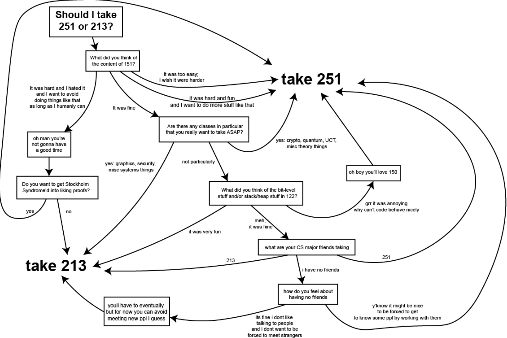

NOTE: The following info is (mostly) a condensed version of various documents Veronica Peet (your first-year advisor) sends out about course selection. This is not intended to be a substitute for those documents - you should read Veronica’s course selection documents thoroughly as well.

This course progression also assumes you are going for the B.S in Computer Science. If you are Comp Bio, AI, etc, there will be some differences in the core classes you take. In particular, Comp Bio majors tend to substitute 15-150: Principles of Functional Programming for 02-251: Great Ideas in Comp Bio in freshman spring.

## SCS Transfer Credit

The main classes that CS majors can get credit for that are directly relevant to your major course progression are 21-120 (Calculus I), 21-122 (Calculus II), and 15-112 (Intro to CS). You can get credit for them in the following ways:

| 21-120 (Differential and Integral Calculus) | 21-122 (Integration and Approximation) | 15-112 (Fundamentals of Programming and Computer Science) |
|---|---|---|
| - 5 on AP Calc AB exam - 5 on AP Calc BC, AB portion subscore - 6 on IB Mathematics | - 5 on AP Calc BC exam - 7 on IB Mathematics - Sufficiently high score on Calculus placement exam | - 5 on AP CSA exam - 6 or 7 on IB Computer Science - Sufficiently high score on CS placement exam |

## SCS Freshman Fall

The SCS freshman fall schedule is largely pre-determined by what AP/IB credit you have, from above. In general, you take one discrete math course, one other math course, one programming course, one gened, and First-year Immigration Course (07-128) freshman year. You are also encouraged to but not required to take Great Practical Ideas in Computer Science (07-131). The options for your discrete math course, other math course, and computer science course are listed below:

| Discrete Math | Other Math | Computer Science |
|---|---|---|
| **15-151: Mathematical Concepts for Computer Science**  REQUIRES: 21-120  An introductory discrete math course. Relatively standard for CS anywhere, but odds are this will be your first time seeing proofs and various other bits of mathematical formalism. Personally, I found this to be the hardest, but also most rewarding class I took freshman year. | **21-241: Matrices and Linear Transformations OR 21-242: Matrix Theory**  REQUIRES: (in practice) 21-122  241 is a relatively standard and fairly computational introduction to linear algebra. If you choose to take the [Mathematical Maturity Survey](https://cmu.guide/mms/), you can place into 242, which is much more theory heavy. | **15-122: Principles of Imperative Computation**  REQUIRES: 15-112  A first course in data structures and algorithms, but (rather uniquely to CMU) with a strong focus on using preconditions, postconditions, and invariants to reason about and write proofs about your code. |
| **21-108: Introduction to Mathematical Concepts**  This is a half semester mini course which prepares you for Concepts (21-127 or 15-151), which you will take in the spring. | **21-122: Integration and Approximation**  REQUIRES: 21-120  Fairly standard Calculus II course. One thing to note that is that if you have only 21-120 credit (e.g. if you got a 5 on AP Calc AB but a 4 on AP Calc BC), it might be possible to kick this to freshman spring and take 21-241 with most of the incoming CS freshmen. | **15-112: Fundamentals of Programming and Computer Science**  An introduction to CS and programming in Python. You do all the basic CS stuff (recursion, loops, lists, time complexity), but the course is also well-known for the final term project, which is very open-ended, and can be very impressive if you put sufficient effort into it. |
|  | **21-120: Differentiation and Integration**  Fairly standard Calculus I course. Though it tends to be taught by postdocs, who are rather high variance…. |  |

## SCS Freshman Spring

Freshman spring is somewhat higher-variance than freshman fall, but is still largely constant, and based on what you took the previous semester. The biggest branching factor is whether or not you took 15-151 (Concepts) in freshman fall.

### If you took Concepts

You will take 2 CS courses, 1 math course, and 1 gened. Your options are listed below:

| First CS Course | Second CS Course | Math |
|---|---|---|
| **15-150: Principles of Functional Programming**  REQUIRES: 15-151 and 15-112  For the vast majority of CMU students, this will be your first introduction to functional programming. More than that, however, 150 continues with the idea introduced by 122 about learning to reason about your code, and to write proofs about your code. Even if you never touch a functional programming language again, I believe that the ideas taught in this course - learning to use a strong type system to your advantage, to reason about your code effectively, and to organize your code well - are essential to become a better programmer. | **15-251: Great Ideas in Theoretical Computer Science**  REQUIRES: 15-151 and 15-122  There are two big questions in theoretical computer science. The first is computability - what problems can we actually devise an algorithm to solve? The second is complexity - what problems can we devise an algorithm that solves it *efficiently*? These two questions fuel the entire field of theoretical computer science, and 251 takes you on a whirlwind tour of all of the intricacies of these questions. Most of all, 251 builds on 151, in the sense that you’ll continue to do more proofs. In particular, you want to prove that a particular problem is uncomputable, or that it lies in a particular complexity class. | **21-259: Calculus in Three Dimensions OR 21-266: Vector Calculus using Matrix Algebra OR 21-268: Multidimensional Calculus OR 21-269: Vector Analysis**  REQUIRES: 21-241 and 21-122 (Strictly speaking, 21-259 only requires 21-122, but in practice if you need 21-241 you’ll take that first)  CMU has several options for a multivariable calculus class. In increasing order of mathematical proofiness, they are 21-259, 21-266, 21-268, and 21-269. The majority of CS majors take either 21-259 or 21-266. 21-259 is a bit easier, while 21-266 has a few more interesting things in the intersection of linear algebra and multivariable calculus, and is also taught by Clive Newstead, who is fantastic. 21-268 is taken mostly by math majors, for the sake of better preparation for real analysis. 21-269 is taken as a precursor to the Math Studies pathway. |
| **02-180 and 02-181: Great Ideas in Computational Biology**  REQUIRES: 15-151  If you’re a computational biology major, you’ll take Great Ideas in Comp Bio in place of 150 (since 150 isn’t required for the Comp Bio major). This class is basically an algorithms class with a bit of biology flavor, in that the class is largely about various algorithms used in computational biology. It’s actually quite a bit of work, but it’s also a very fun and rewarding class. | **15-213: Introduction to Computer Systems**  REQUIRES: 15-122  This class is about how computers actually work under the hood. You’ll learn about memory, bits, shell processes, threads, and parallelism. The other important part of this class is that this is the first class where you’re intended to write a several-hundred to thousand line project all by yourself, with minimal guidance from the writeup. This means that you have to fully understand the architecture and design of your projects. | **21-241: Matrices and Linear Transformations** |
|  | **15-122: Principles of Imperative Computation**  If you took 15-112 last semester, you’ll be taking 15-122 as your second CS course. The same thing I said above applies here. |  |

Note that the line between your first and second CS course is not as fixed as your freshman fall course selection. For example, I know someone who took both 15-150 and Great Ideas in Comp Bio their freshman spring. However, you **cannot** take both 15-251 and 15-213 (Veronica will explicitly deregister you from both if you do so).

Choosing between 15-251 and 15-213 is arguably the most important course selection decision you’ll make for your freshman spring (if you aren’t taking 15-122 instead). In general, if you liked 15-151 more, you’ll take 15-251 first, while if you liked 15-122 more, you’ll take 15-213 first. Another factor to consider is which one your friends are taking. In particular, 15-251 has a group homework system, so if a lot of your friends are taking 15-251 you might want to consider taking 15-251. For a more detailed view, consider the following flowchart:

### If you didn’t take Concepts

You should take whatever courses in the SCS Freshman Fall table you haven’t taken already. Most likely, this will be 15-122, Concepts, and 21-122 or 21-241. Note that usually 15-151 does not run in the spring, so you’ll most likely be taking 21-127.

## SCS Sophomore Fall

At this point, course selection is a lot more free-form. The primary thing for sophomore fall course selection is that you are not allowed to take 2 or more 200-level CS core courses (i.e. 15-213, 15-251, or 15-210) at the same time, unless you have done extremely well in all your previous courses. Regardless of whether you are able to do this, I would recommend against it, given that all the 200-level CS cores are a very significant time commitment.

Generally, people take one 200-level CS core, 2 additional CS or math technicals, and a gened. At this point you should have a general sense of how difficult the CMU courseload is for you, so you can (and should) adjust this up or down based on how you did in your freshman year.

Below is a list of courses people tend to take in their sophomore fall. This list is certainly not exhaustive, but can serve as a good starting point.

- Probability requirement
  - 15-259: Probability and Computing
  - 36-225: Introduction to Probability Theory
  - 36-218: Probability Theory for Computer Scientists
    - This course is probably bad if you want to do anything involving probability (since Professor Genovese teaches the course using his unique terms and Python library for everything), but it’s arguably the quickest and easiest way to satisfy your probability requirement.
  - 21-325: Probability
  - If you don’t really have a strong preference towards a particular CS elective, taking your probability requirement can be a good choice (since probability unlocks quite a few courses). The difficulty of these courses is generally considered to be 36-225 < 36-218 < 15-259 < 21-325.
- Domains requirement
  - 15-362: Computer Graphics
  - 15-330: Computer Security
- PL requirement
  - 15-312: Foundations of Programming Languages
  - 15-316: Software Foundations of Security and Privacy
  - 17-363: Programming Language Pragmatics
  - As a PL concentration, I strongly recommend either 15-312 or 17-363. 15-312 is more theory heavy, while 17-363 blends theory with implementation, but both are great introductions to PL theory, which I personally think is quite interesting.
- AI requirement
  - 16-385: Computer Vision
  - 11-485: Intro to Deep Learning
    - Note that this one is a very high time commitment (close to 20 hours/week).
  - 07-280: AI and ML I
- Systems elective
  - 15-440: Distributed Systems
    - This is also fairly high time commitment. I would only recommend this if you did very well in 15-213. Also, you might have to spend a bit of time on the waitlist. People do drop this course a lot, so you will eventually get off, but it might take a few weeks.
